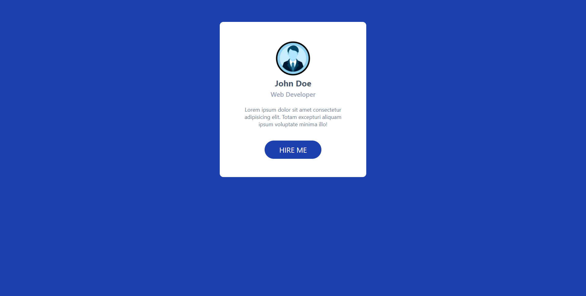

# Profile-Card-With-Tailwindcss

- Your Task to Setup This App
- 1- Clone the repo
- 2- run "npm run build-css" to start the watchdog if you want to customize
- 4- Customize, Test and Enjoy
- Done

